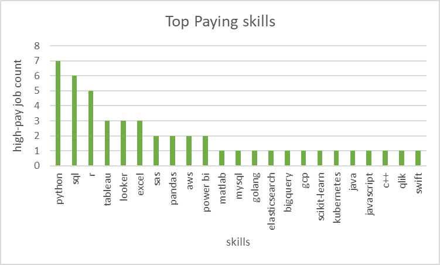

TODO:need to work on this
# Introduction
 This project analyzes the data analyst job market, highlighting  high-paying roles, in-demand skills, and the intersection of strong demand and competitive salaries in data analytics.
 SQL queries? Check them out here: [project_sql folder](/project_files_sql/)
# Background
Motivated by the challenge of navigating the data analyst job market, this project focuses on uncovering high-demand skills and top-paying roles to help others make informed career decisions.

Data is collected from [SQL COURSE](https://lukebarousse.com/sql), it has vast data of job postings of all over world

### The questions I wanted to answer through my SQL queires were:

1. What are top-paying Data Analyst jobs?
2. What skills are required for these top-paying jobs?
3. What skills are most in demand for Data Analysts?
4. which skills are associated with higher salaries?
5. What are the most Optimal skills to learn?
# Tools I used
To achieve my desired outputs, i harnessed the power of several key tools:

- **SQL**: The backbone of the project, allowing me to query the database and unearth critical insights.

- **PostgresSQL**:The chosen database management system, ideal for handling the job posting data.

- **Visual Studio Code**: It is one of The best in market to management and executing SQL queries.

- **Git & GitHub**: Essential for version contril and sharing my SQL scripts and analysis, ensuring collaboration and project tracking.
# The Analysis
Each query for this project aimed at finding specific aspects of the data analyst job market.
Here's how i approached each task or question:

### 1.Top paying Data Analyst Jobs
To identify the highest-paying roles, I filtered data analyst positions by average yearly salary and location, focusing on remote jobs. This query highlights the high paying opportunities in the field.

``` sql
SELECT 
     job_id,
     job_title,
     job_location,
     job_schedule_type,
     salary_year_avg,
     job_posted_date,
     name as company_name
FROM
     job_postings_fact
left JOIN company_dim on job_postings_fact.company_id=company_dim.company_id
where job_title='Data Analyst' and 
      salary_year_avg is not NULL AND
      job_location='Anywhere'
ORDER BY
      salary_year_avg DESC
LIMIT 10;
```
Here's the breakdown of the top data analyst jobs in 2023:

- **Wide Salary Range**: Top 10 paying data analyst roles span from ₹1,35,000 to ₹6,50,000, indicating significant salary potential in the field.
- **Diverse Employers**: Companies like SmartAsset, Meta, and AT&T are among those offering high salaries, showing a broad interest across different industries.
- **Job Title Variety**: There's a high diversity in job titles, from Data Analyst to Director of Analytics, reflecting varied roles and specializations within data analytics.
### 2. Skills for Top Paying Jobs
To understand what skills are required for the top-paying jobs, I joined the job postings with the skills data, providing insights into what employers value for high-compensation roles.

```sql
with top_paying_jobs AS
(
SELECT 
     job_id,
     job_title,
     job_location,
     job_schedule_type,
     salary_year_avg,
     job_posted_date,
     name as company_name
FROM
     job_postings_fact
left JOIN company_dim on job_postings_fact.company_id=company_dim.company_id
where 
      job_title='Data Analyst' and 
      salary_year_avg is not NULL AND
      job_location='Anywhere'
ORDER BY
      salary_year_avg DESC
LIMIT 10
)
SELECT 
      top_paying_jobs.*,
      skills
FROM top_paying_jobs
INNER JOIN skills_job_dim on top_paying_jobs.job_id=skills_job_dim.job_id
INNER JOIN skills_dim on skills_job_dim.skill_id=skills_dim.skill_id
ORDER BY
   salary_year_avg DESC;
```    
Here's the breakdown of the most demanded skills for the top 10 highest paying data analyst jobs in 2023:

- Python is leading with a bold count of 7.
- SQL follows closely with a bold count of 6.
- Tableau is also highly sought after, with a bold count of 5. Other skills like R, Snowflake, Pandas, and Excel show varying degrees of demand.


### 3. In-Demand Skills for Data Analysts
This query helped identify the skills most frequently requested in job postings, directing focus to areas with high demand.

```sql
SELECT
  skills,
  count(skills_job_dim.job_id) demand_skills
from job_postings_fact
INNER JOIN skills_job_dim on job_postings_fact.job_id=skills_job_dim.job_id
INNER JOIN skills_dim on skills_job_dim.skill_id = skills_dim.skill_id
WHERE
      job_title='Data Analyst'
GROUP BY
     skills
ORDER BY 
     demand_skills DESC
LIMIT 5;
```

Here's the breakdown of the most demanded skills for data analysts in 2023

- **SQL and Excel** remain fundamental, emphasizing the need for strong foundational skills in data processing and spreadsheet manipulation.
- Programming and Visualization Tools like Python, Tableau, and Power BI are essential, pointing towards the increasing importance of technical skills in data storytelling and decision support.
### Most In-Demand Skills for Data Analysts

| Skill     | Demand (Job Count) |
|-----------|-------------------|
| SQL       | 24,099            |
| Excel     | 15,154            |
| Python    | 14,246            |
| Tableau   | 12,112            |
| Power BI  | 10,156            |

Table of the demand for the top 5 skills in data analyst job postings

### 4. Skills Based on Salary
Exploring the average salaries associated with different skills revealed which skills are the highest paying.

```sql
SELECT
  skills,
  round(avg(salary_year_avg),0) Avg_salary
from job_postings_fact
INNER JOIN skills_job_dim on job_postings_fact.job_id=skills_job_dim.job_id
INNER JOIN skills_dim on skills_job_dim.skill_id = skills_dim.skill_id
WHERE
      job_title='Data Analyst' and
       salary_year_avg is not NULL and job_country='India'
GROUP BY
     skills
ORDER BY 
    Avg_salary DESC
LIMIT 25
;
```
Here's a breakdown of the results for top paying skills for Data Analysts:

- **High Demand for Big Data & ML Skills**: Top salaries are commanded by analysts skilled in big data technologies (PySpark, Couchbase), machine learning tools (DataRobot, Jupyter), and Python libraries (Pandas, NumPy), reflecting the industry's high valuation of data processing and predictive modeling capabilities.
- **Software Development & Deployment Proficiency**: Knowledge in development and deployment tools (GitLab, Kubernetes, Airflow) indicates a lucrative crossover between data analysis and engineering, with a premium on skills that facilitate automation and efficient data pipeline management.
- **Cloud Computing Expertise**: Familiarity with cloud and data engineering tools (Elasticsearch, Databricks, GCP) underscores the growing importance of cloud-based analytics environments, suggesting that cloud proficiency significantly boosts earning potential in data analytics.
### Top-10 Highest-Paying Skills for Data Analysts (Average Salary)

| Skill        | Avg Salary (₹) |
|-------------|-----------------|
| Airflow     | 1,11,175        |
| DAX         | 1,11,175        |
| Excel       | 1,11,175        |
| Express     | 1,11,175        |
| Go          | 1,11,175        |
| Jira        | 1,11,175        |
| Looker      | 1,11,175        |
| Outlook     | 1,11,175        |
| PowerPoint  | 1,11,175        |
| Spark       | 1,11,175        |

Table of the average salary for the top 10 paying skills for data analysts
### 5. Most Optimal Skills to Learn
Combining insights from demand and salary data, this query aimed to pinpoint skills that are both in high demand and have high salaries, offering a strategic focus for skill development.

```sql
with skills_demand AS(
SELECT
  skills_dim.skill_id,
  skills_dim.skills,
  count(skills_job_dim.job_id) demand_skills
from job_postings_fact
INNER JOIN skills_job_dim on job_postings_fact.job_id=skills_job_dim.job_id
INNER JOIN skills_dim on skills_job_dim.skill_id = skills_dim.skill_id
WHERE
      job_title='Data Analyst' AND
      salary_year_avg is not NULL AND
      job_work_from_home = TRUE
GROUP BY
    skills_dim.skill_id

),average_Salary AS (
SELECT
 skills_dim.skill_id,
  round(avg(salary_year_avg),0) Avg_salary
from job_postings_fact
INNER JOIN skills_job_dim on job_postings_fact.job_id=skills_job_dim.job_id
INNER JOIN skills_dim on skills_job_dim.skill_id = skills_dim.skill_id
WHERE
      job_title='Data Analyst' and
       salary_year_avg is not NULL and 
       job_work_from_home = TRUE
GROUP BY
     skills_dim.skill_id
)

SELECT
 skills_demand.skill_id,
 skills_demand.skills,
 demand_skills,
 Avg_salary
from
  skills_demand
INNER join average_salary on skills_demand.skill_id=average_Salary.skill_id
where demand_skills>10
ORDER BY
    demand_skills DESC,
    Avg_salary DESC;
```
### High-Demand & High-Paying Skills for Data Analysts

| Skill        | Demand (Job Count) | Avg Salary (₹) |
|--------------|-------------------:|---------------:|
| SQL          | 121                | 90,624         |
| Python       | 76                 | 95,080         |
| Tableau      | 71                 | 93,863         |
| Excel        | 65                 | 85,326         |
| R            | 49                 | 93,704         |
| Power BI     | 36                 | 91,098         |
| SAS          | 22                 | 89,859         |
| Looker       | 20                 | 98,128         |
| PowerPoint   | 14                 | 89,351         |
| Azure        | 12                 | 88,292         |
| JavaScript   | 11                 | 96,182         |

Table of the most optimal skills for data analyst sorted by salary

Here's a breakdown of the most optimal skills for Data Analysts in 2023:

- **High-Demand Programming Languages**: SQL and Python stand out for their high demand, with demand counts of 121 and 76 respectively. Despite their high demand, their average salaries are around ₹95,080 for Python and ₹90,624 for SQL, indicating that proficiency in these languages is highly valued but also widely available.
- **Cloud Tools and Technologies**: Skills in specialized technologies such as Snowflake, Azure, AWS, and BigQuery show significant demand with relatively high average salaries, pointing towards the growing importance of cloud platforms and big data technologies in data analysis.
- **Business Intelligence and Visualization Tools**: Tableau and Looker, with demand counts of 71 and 20 respectively, and average salaries around ₹99,288 and ₹1,03,795, highlight the critical role of data visualization and business intelligence in deriving actionable insights from data.
- **Database Technologies**: The demand for skills in traditional and NoSQL databases (Oracle, SQL Server, NoSQL) with average salaries ranging from ₹97,786 to ₹1,04,534, reflects the enduring need for data storage, retrieval, and management expertise.

# What I Learned
Throughout this adventure, I've turbocharged my SQL toolkit with some serious firepower:

- **Complex Query Crafting**: Mastered the art of advanced SQL, merging tables like a pro and wielding WITH clauses for ninja-level temp table maneuvers.
- **Data Aggregation**: Got cozy with GROUP BY and turned aggregate functions like COUNT() and AVG() into my data-summarizing sidekicks.
- **Analytical Wizardry**: Leveled up my real-world puzzle-solving skills, turning questions into actionable, insightful SQL queries.
# Conclusions
Insights
From the analysis, several general insights emerged:

1. **Top-Paying Data Analyst Jobs**: The highest-paying jobs for data analysts that allow remote work offer a wide range of salaries, the highest at ₹6,50,000!
2. **Skills for Top-Paying Jobs**: High-paying data analyst jobs require advanced proficiency in SQL, suggesting it’s a critical skill for earning a top salary.
3. **Most In-Demand Skills**: SQL is also the most demanded skill in the data analyst job market, thus making it essential for job seekers.
4. **Skills with Higher Salaries**: Specialized skills, such as SQL and Python, are associated with the highest average salaries, indicating a premium on niche expertise.
5. **Optimal Skills for Job Market Value**: SQL leads in demand and offers for a high average salary, positioning it as one of the most optimal skills for data analysts to learn to maximize their market value.

